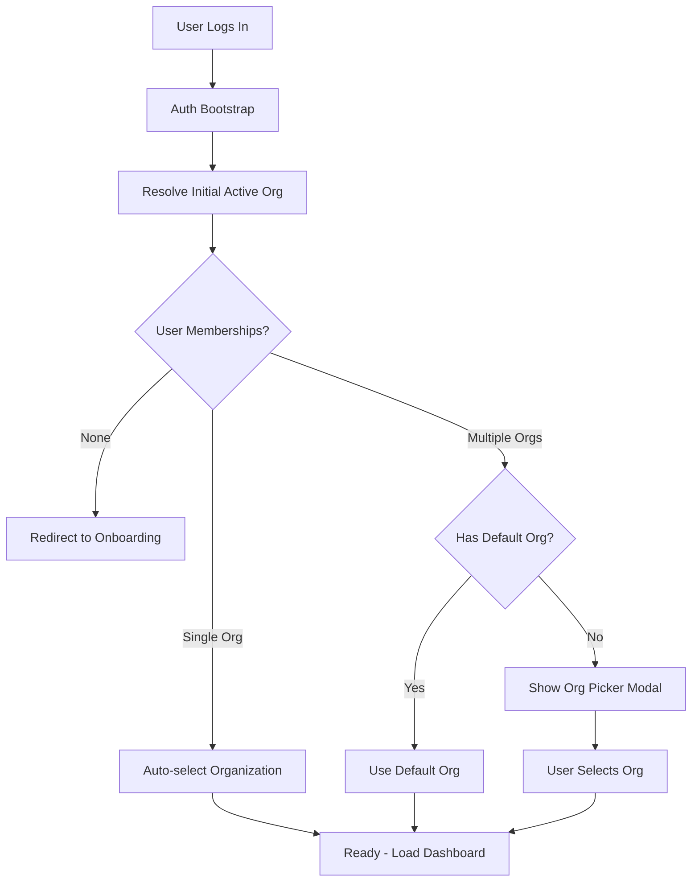
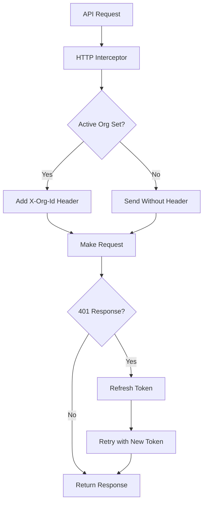

# IoT Platform Frontend - Multi-Organization Support

A React/TypeScript frontend application for IoT device management with comprehensive multi-organization support.

## 🏢 Multi-Organization Architecture

This application supports users belonging to multiple organizations with seamless switching and proper data isolation.

### Key Features

- **Automatic Organization Selection**: Single-org users are automatically logged into their organization
- **Smart Organization Picker**: Multi-org users see a selection modal on first login
- **Navbar Organization Selector**: Quick switching between organizations for multi-org users
- **User Preferences**: Remember organization choice or ask every time
- **Proper Data Isolation**: All API calls include organization context headers
- **Error Prevention**: Prevents 403/500 errors from missing organization context

## 🚀 Quick Start

```bash
# Install dependencies
npm install

# Start development server
npm run dev

# Build for production
npm run build

# Type check
npx tsc --noEmit
```

## 📁 Project Structure

```
src/
├── api/                    # API services and HTTP client
│   ├── http.ts            # Axios client with org context injection
│   ├── user.service.ts    # User profile and settings API
│   ├── org.service.ts     # Organization API
│   └── types.ts           # API response types and unwrapping
├── components/            # Reusable UI components
│   ├── OrgPickerModal.tsx # Organization selection modal
│   ├── OrgSelector.tsx    # Navbar organization dropdown
│   └── OrganizationPreferences.tsx # Settings page component
├── store/                 # Redux state management
│   ├── activeOrgSlice.ts  # Organization context state
│   ├── profileSlice.ts    # User profile state
│   └── index.ts           # Store configuration
├── layouts/               # Page layouts
│   └── dashboard-layout.tsx # Main dashboard layout
├── pages/                 # Application pages
│   ├── settings.tsx       # Settings page with org preferences
│   └── DashboardHome.tsx  # Main dashboard page
└── lib/auth/              # Authentication logic
    └── AuthBootstrap.tsx  # Auth initialization
```

## 🔄 Organization Flow

### 1. Initial Login Flow



### 2. API Request Flow



## 🏗️ Key Components

### ActiveOrgSlice (`src/store/activeOrgSlice.ts`)

Central state management for organization context:

```typescript
interface ActiveOrgState {
  status: 'idle' | 'resolving' | 'ready' | 'error';
  orgId: string | null;
  orgName: string;
  error: string | null;
}
```

**Key Actions:**
- `resolveInitialActiveOrg()` - Determines initial organization on login
- `selectOrgAndFinalize()` - Switches to a specific organization
- Various setters for manual state updates

**Selectors:**
- `selectActiveOrgId()` - Current organization ID
- `selectActiveOrgReady()` - Whether org context is ready
- `selectActiveOrgName()` - Current organization name
- `selectActiveOrgStatus()` - Current status

### HTTP Client (`src/api/http.ts`)

Axios client with automatic organization context injection:

- **X-Org-Id Header**: Automatically added to all requests when organization is active
- **Token Refresh**: Handles JWT refresh with proper header re-attachment
- **Circular Dependency Prevention**: Uses store reference pattern to avoid import cycles

### Organization Picker Modal (`src/components/OrgPickerModal.tsx`)

Modal for organization selection when user has multiple memberships:

- Radio button selection of available organizations
- "Remember my choice" option
- Integrates with user settings API
- Cannot be dismissed until selection is made

### Organization Selector (`src/components/OrgSelector.tsx`)

Navbar dropdown for organization switching:

- Hidden for single-organization users (shows simple chip instead)
- Dropdown with organization list for multi-org users
- Real-time organization switching
- Link to organization management settings

### Organization Preferences (`src/components/OrganizationPreferences.tsx`)

Settings page section for organization management:

- Default organization selection
- Choice mode toggle (remember vs ask every time)
- Current organization status display
- List of all user's organizations with roles

## 🔧 API Integration

### Response Envelope

All API responses follow a standard envelope format:

```typescript
interface ApiResponse<T> {
  status: number;
  success: boolean;
  message?: string;
  data: T;
  from?: string;
  error?: any;
  pagination?: PaginationInfo;
}
```

Use the `unwrapApiResponse<T>()` helper to extract data and handle errors:

```typescript
// In service methods
const response = await http.get<ApiResponse<UserData>>('/users/me');
return unwrapApiResponse(response.data);
```

### Organization Context Headers

The HTTP client automatically adds `X-Org-Id` headers:

```typescript
// Automatic header injection
if (storeRef) {
  const state = storeRef.getState();
  const activeOrgId = state.activeOrg?.orgId;
  if (activeOrgId) {
    cfg.headers["X-Org-Id"] = activeOrgId;
  }
}
```

### User Settings API

```typescript
// Get user preferences
const settings = await UserService.getMySettings();

// Update preferences
await UserService.updateMySettings({
  defaultOrgId: 'org-id',
  orgChoiceMode: 'remember' // or 'ask-every-time'
});
```

## 🛡️ Error Prevention

### Gated API Calls

Prevent API calls before organization context is ready:

```typescript
const activeOrgReady = useAppSelector(selectActiveOrgReady);

useEffect(() => {
  if (activeOrgReady) {
    // Safe to make org-scoped API calls
    dispatch(fetchGateways());
    dispatch(fetchSensors());
  }
}, [activeOrgReady, dispatch]);
```

### Loading States

Show loading indicators while organization context resolves:

```typescript
const orgStatus = useAppSelector(selectActiveOrgStatus);
const isLoading = orgStatus === 'resolving';

if (isLoading) {
  return <LoadingSpinner />;
}
```

## 🎨 UI Patterns

### Single vs Multi-Organization Users

**Single Organization Users:**
- No organization picker modal
- Simple organization chip in navbar
- Streamlined experience

**Multi-Organization Users:**
- Organization picker modal on first login (if no default)
- Organization selector dropdown in navbar
- Full preferences management in settings

### Loading States

- Skeleton loaders during organization resolution
- Disabled states during organization switching
- Loading indicators for preference updates

### Error Handling

- Toast notifications for failed operations
- Fallback UI for missing organization context
- Graceful degradation when services are unavailable

## 🔍 Debugging

### Debug Org Requests

Enable request debugging with environment variable:

```bash
VITE_DEBUG_ORG_REQUESTS=true
```

This logs all HTTP requests with organization header status:

```
[HTTP] GET /gateways {X-Org-Id: 'org-123', Authorization: 'PRESENT'}
[HTTP] POST /sensors {X-Org-Id: 'NOT_SET', Authorization: 'PRESENT'}
```

### Common Issues

1. **403/500 Errors**: Usually caused by missing `X-Org-Id` header
   - Check if `activeOrgReady` is true before making API calls
   - Verify organization context is properly resolved

2. **Circular Dependency**: Avoided by using store reference pattern
   - HTTP client doesn't directly import store
   - Store reference is set after store creation

3. **Race Conditions**: Prevented by proper gating
   - Use `activeOrgReady` selector to gate org-scoped operations
   - Organization resolution completes before data fetching

## 🚀 Deployment

### Environment Variables

```bash
# API Configuration
VITE_API_BASE=https://api.iot-platform.com

# AWS Cognito Configuration
VITE_COGNITO_USER_POOL_ID=us-east-1_xxxxx
VITE_COGNITO_CLIENT_ID=xxxxxxxxxxxxxxxxxxxxx
VITE_COGNITO_REGION=us-east-1

# Debug Flags (optional)
VITE_DEBUG_ORG_REQUESTS=false
```

### Build Configuration

```bash
# Development build
npm run dev

# Production build
npm run build

# Preview production build
npm run preview
```

## 📝 Contributing

### Code Style

- Use TypeScript for all new code
- Follow existing naming conventions
- Add proper error handling
- Include loading states for async operations

### Adding New Org-Scoped Features

1. **API Service**: Use `unwrapApiResponse()` for response handling
2. **Redux Slice**: Gate thunks with organization readiness
3. **Components**: Use `selectActiveOrgReady` to prevent premature calls
4. **Error Handling**: Provide fallback UI for missing org context

### Testing Organization Flow

1. **Single Org User**: Test automatic organization selection
2. **Multi Org User**: Test picker modal and switching
3. **No Memberships**: Test onboarding redirect
4. **Error Cases**: Test missing org context handling

## 🆘 Support

For issues related to multi-organization support:

1. Check browser console for `X-Org-Id` header presence
2. Verify `activeOrgStatus` in Redux DevTools
3. Ensure API calls are gated behind `activeOrgReady`
4. Review organization resolution flow in AuthBootstrap

## 📜 License

[Add your license information here]

---

**Version**: 2.0.0 with Multi-Organization Support  
**Last Updated**: September 6, 2025  
**Architecture**: React 18 + TypeScript + Redux Toolkit + Vite
